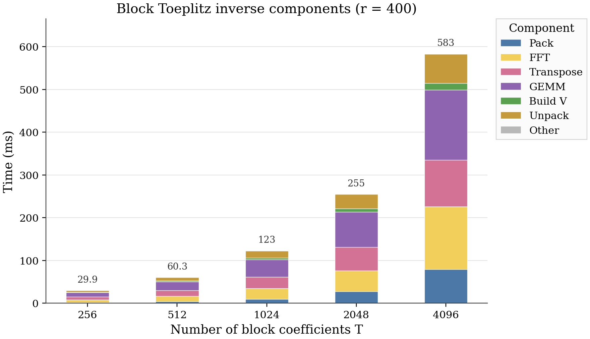
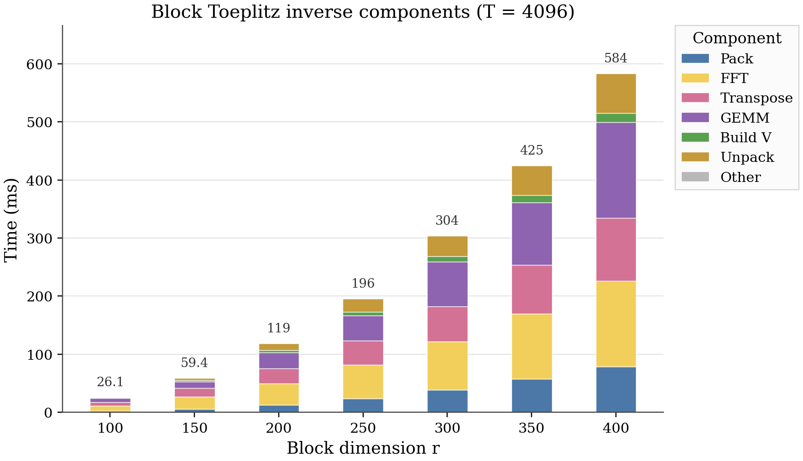
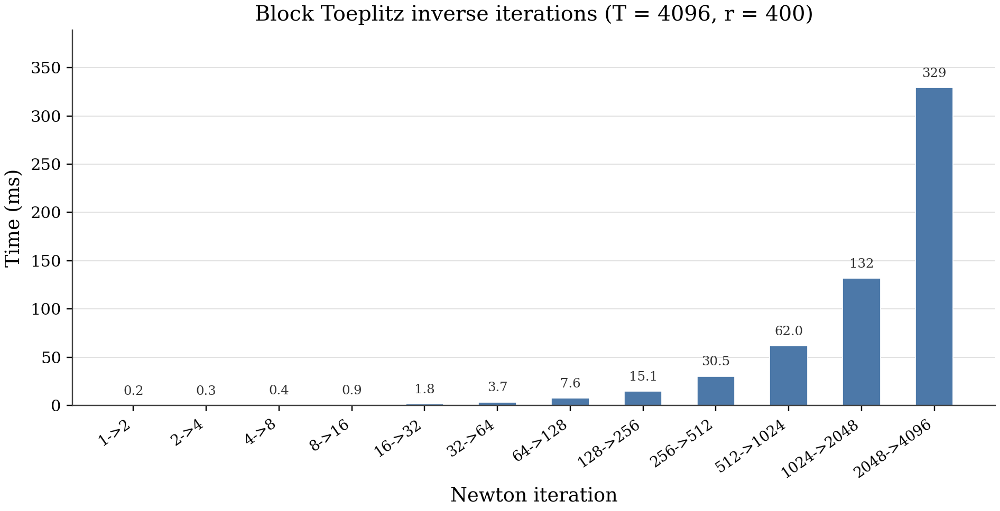

# Block Toeplitz Inverse Benchmark Results

This note summarizes the current single-GPU benchmark results for the block
Toeplitz inverse prototype, plus the memory partitioning result from the
distributed prototype. The implementation details for the single-GPU path are
described in [Single-GPU Block Toeplitz Inverse](block_toeplitz_inverse_single_gpu.md).

## Measurement Setup

- GPU target: NVIDIA H100.
- Arithmetic: real buffers in double precision and frequency-domain products in
  complex double precision.
- `T`: number of block coefficients.
- `r`: dense block dimension, so each coefficient block has `r x r` scalar
  entries.
- Component timings are summed GPU kernel times from the captured profiling
  region, grouped by kernel family:
  - `Pack`: real block coefficients to FFT-entry layout.
  - `FFT`: cuFFT kernels plus cuFFT preprocess/postprocess kernels.
  - `Transpose`: layout conversions used around frequency-major operations.
  - `GEMM`: cuBLAS complex batched GEMM in frequency space.
  - `Build V`: Newton correction construction.
  - `Unpack`: real FFT-entry layout back to coefficient blocks.
  - `Other`: remaining measured GPU kernels.

## Sweep Over T at Fixed r = 400



For fixed `r = 400`, the total time grows close to a doubling pattern as `T`
doubles:

| T | Total time (ms) |
|---:|---:|
| 256 | 29.9 |
| 512 | 60.3 |
| 1024 | 123 |
| 2048 | 255 |
| 4096 | 583 |

The main components all grow with `T`, but the larger cases are increasingly
dominated by the final Newton iterations. At `T = 4096`, the largest
contributors are FFT-related kernels, transpose/layout movement, GEMM, pack, and
unpack. This is consistent with the algorithm repeatedly doing FFT-based
convolutions over a growing coefficient range.

## Sweep Over r at Fixed T = 4096



For fixed `T = 4096`, increasing `r` increases both the number of scalar time
series (`r^2`) and the matrix multiplication cost in frequency space:

| r | Total time (ms) |
|---:|---:|
| 100 | 26.1 |
| 150 | 59.4 |
| 200 | 119 |
| 250 | 196 |
| 300 | 304 |
| 350 | 425 |
| 400 | 584 |

The non-GEMM components, such as pack, FFT, transpose, and unpack, grow with the
number of scalar entries. GEMM grows faster and becomes a major component at the
larger block sizes, because each frequency point requires a dense `r x r`
complex matrix product.

## Newton Iteration Timing



For `T = 4096` and `r = 400`, the Newton doubling schedule has 12 iterations:

| Iteration | Time (ms) |
|---:|---:|
| 1 -> 2 | 0.2 |
| 2 -> 4 | 0.3 |
| 4 -> 8 | 0.4 |
| 8 -> 16 | 0.9 |
| 16 -> 32 | 1.8 |
| 32 -> 64 | 3.7 |
| 64 -> 128 | 7.6 |
| 128 -> 256 | 15.1 |
| 256 -> 512 | 30.5 |
| 512 -> 1024 | 62.0 |
| 1024 -> 2048 | 132 |
| 2048 -> 4096 | 329 |

The last iteration alone accounts for about 56% of the total time, and the last
two iterations account for about 79%. This is expected from Newton doubling: the
early iterations are small, while the final iterations operate over the largest
coefficient ranges and FFT lengths.

## Nsight Compute Notes

The Nsight Compute runs were taken at `T = 4096`, `r = 400`, restricted to the
final Newton iteration `2048 -> 4096` with FFT length `8192`.

| Component | Representative kernel | Key metrics | Interpretation |
|---|---|---|---|
| GEMM | `sm90_xmma_gemm_cf64cf64_f64f64_cf64_nn...tensor16x8x16...` | Compute throughput about 89%, DRAM throughput about 26%, memory throughput about 56% | cuBLAS selected the H100 SM90 XMMA / FP64 Tensor Core path. This part is compute-bound. |
| FFT | cuFFT `vector_fft<4096,...double...>` plus preprocess/postprocess kernels | DRAM throughput about 87-88%, compute throughput about 20-23% | FFT-related work is primarily memory-bandwidth-bound. |

This explains the component profile: GEMM is already using a highly optimized
library path, while FFT and layout movement are more limited by memory traffic.

## Distributed Memory Partition

The distributed prototype was tested for the large case `T = 8192`, `r = 400`.
The full coefficient matrix has

```text
T * r * r = 8192 * 400 * 400
```

double entries, or about 9.77 GiB for the coefficient data alone. The full
single-GPU workspace estimate was about 175.8 GiB, which exceeds the available
H100 memory in our run.

With a `2 x 2` process grid across four GPUs, the `r x r` block entry matrix is
partitioned by block rows and block columns:

| Quantity | Global | Per GPU in 2 x 2 grid |
|---|---:|---:|
| Block-entry tile | `400 x 400` | `200 x 200` |
| Scalar entries per coefficient | 160,000 | 40,000 |
| Coefficient storage over `T = 8192` | 9.77 GiB | 2.44 GiB |
| Tracked working memory | OOM on one GPU | about 53.7 GiB per GPU |

So the current distributed result is mainly a capacity result: the same global
problem can be represented as local `200 x 200` matrix tiles per GPU, with each
GPU holding the full time dimension for its owned tile.
